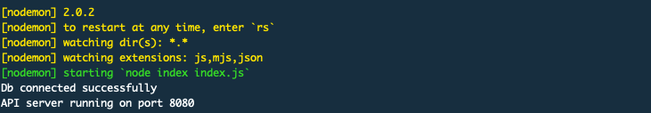
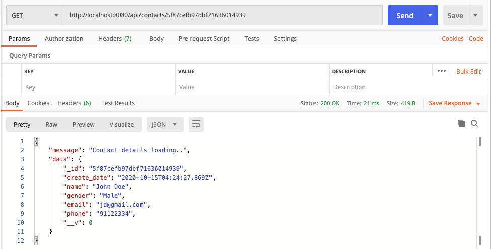
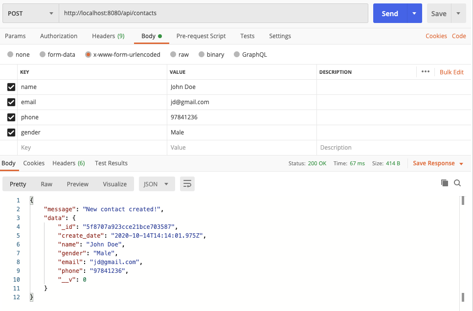
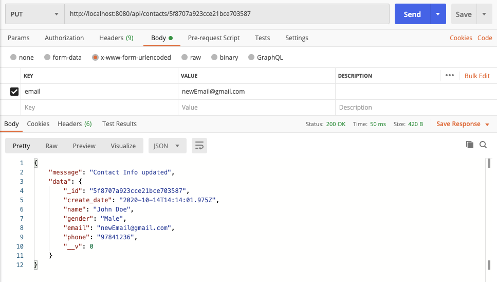
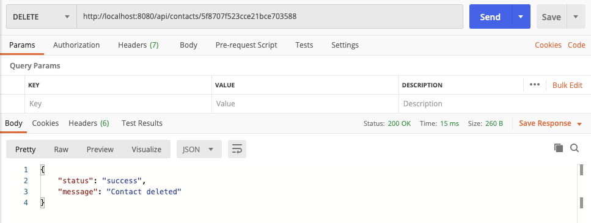
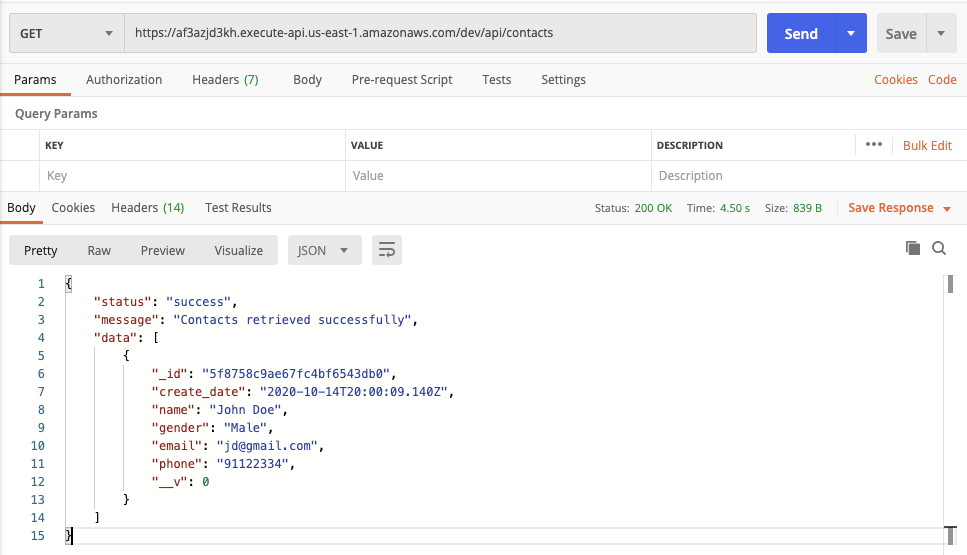
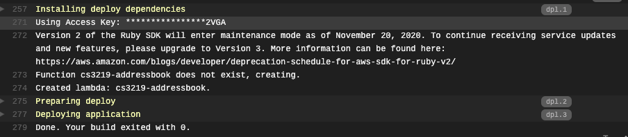

## CS3219 OTOT Task B1 - 3

### Task

1. Implement a simple JS backend and REST API to GET, POST, PUT and DELETE.
2. Write simple test cases for API and use CI tool to automate testing. (Using Mocha Chai)
3. Use CD tool for automated deployment to a serverless server. (Using AWS lambda with Mongo Atlas database.)

### Dependencies

The following dependencies need to be downloaded in order to run the API server locally.

1. node and npm
2. Mongodb

### Setup Instructions (Local)

1. Fork and clone this repo.
2. Start the mongodb instance on your local machine.

```bash
# Linux
mongod

# For MacOS if installed using brew
sudo mongod --config /usr/local/etc/mongod.conf
```

3. Install dependencies for the API server. 

```bash
npm install
```

4. Run the backend server using the `npm start` script.

```bash
npm start
```

5. Upon starting, you will see the following in your console. 

   You can also go to localhost:8080 and you will see a message "APIs are on /api/contacts. Try it out".



### API Endpoints

The following API endpoints are available. You can test them out using Postman.

- `GET /api/contacts` list all contacts

  

- `POST /api/contacts` create new contact

  

- `GET /api/contacts/{id}` retrieve a single contact

  

- `PUT /api/contacts/{id}` update a single contact

  

- `DELETE /api/contacts/{id}` delete a single contact

  

### Deployed API (Hosted on AWS Lambda)

The serverless deployed version of the API can be accessed via the following url.

https://af3azjd3kh.execute-api.us-east-1.amazonaws.com/dev

In particular, the api endpoints are hosted at https://af3azjd3kh.execute-api.us-east-1.amazonaws.com/dev/api.


Similarly to the local API, you can test out the serverless version of the API using Postman.



#### Continuous Deployment

Continuous deployment of the serverless API is setup using Travis. If you fork this repo and set up Travis for this repo, after each merge to the `release` branch, you will see the following. 

Do note that you will have to change the `role` in `.travis.yml`, and add your AWS access key and private key to your travis environment via `AWS_ACCESS_KEY_ID` and `AWS_SECRET_ACCESS_KEY`.

After commits are made to the release branch, and the deployment is successful, you will see the following message in your travis console.



### Testing of API Server

In order to test the API server using the test script (using Mocha Chai), you can run the following command.

```
npm test
```

#### Automated Testing

Automated testing is setup using Travis. When any commits are made to any of the branches, Travis will run through the different tests in `test.js`. If any of the tests fails, the build will fail and a red dot will be shown on the repo page on github. If all the tests are successful, a green dot will be shown instead. 

