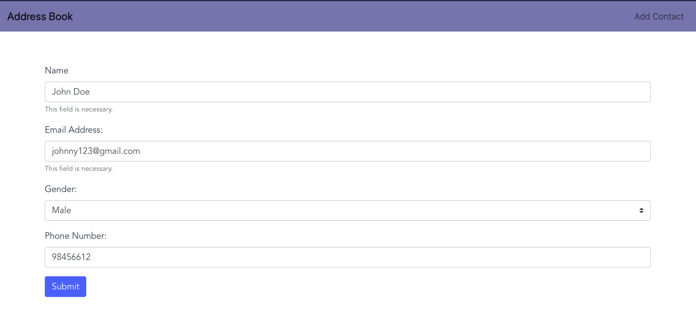

# CS3219 OTOT Task B4

### Task

Build a frontend SPA using Vue or any other framework.

### Frontend Framework Used

The frontend of the application is built using Vue with Vuex.

### Backend Setup

Ensure that the backend server of https://github.com/eugeneyl/CS3219_TaskB_AddressBook is setup locally on 8080. (Or change the `apiURL` in `/src/store/module/contacts.js` to reflect the correct address  )

### Setup Instructions 

1. Navigate to the `web` directory from the main repository.
2. Install dependencies for the frontend.

```bash
npm install
```

3. Run the frontend using the `npm start` script.

```bash
npm start
```

4. Upon starting, you will see the following message on your console. If the backend server is running on port 8080, the frontend will run on port 8081. If not, it will run on 8080 instead. 

```
Your application is running here: http://localhost:8081
```

5. Go to the url from the message in step 4 to access the application. 

### Web Application Breakdown

There are 3 views in this application.

1. Home Page

   Upon entering the webpage, you will be directed to the home page. On this page, you will be able to see all the contacts that you have previously added. You also have the option of adding new contact (top right button), editing a contact, or deleting a contact. 

   

2. Add Contact Page

   The add contact page allows you to fill in the different fields for a new contact to be added.

   

3. Edit Contact Page

   The edit contact page allows you to edit any fields for an existing contact. Upon entering the page, the current contact details of the contact will be shown in the different form entries.

   

